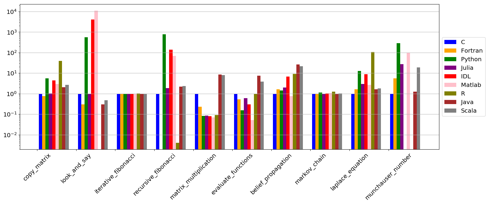
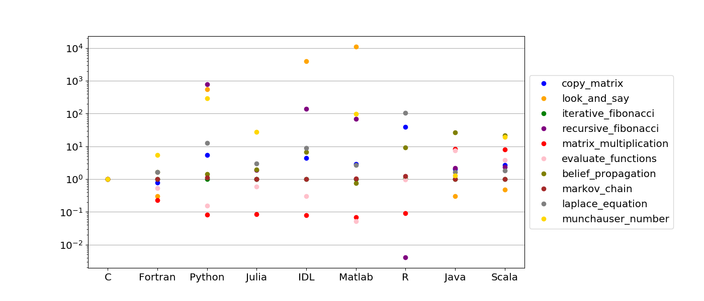
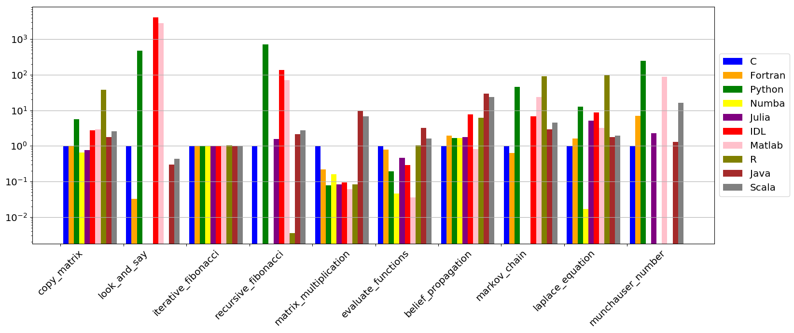
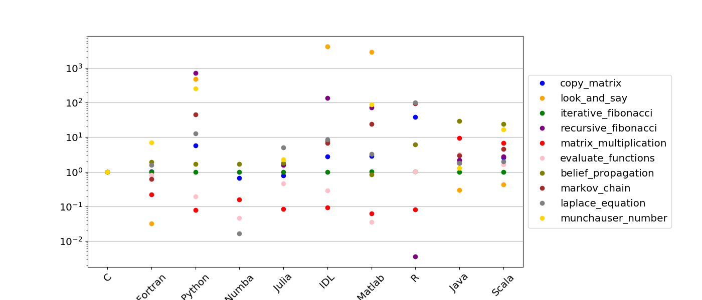
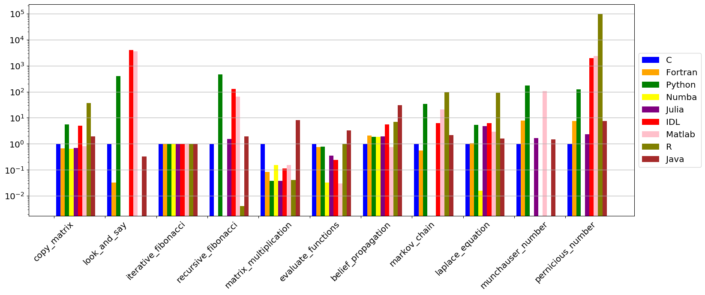
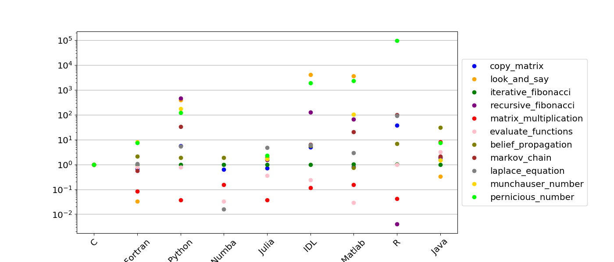

# Basic Comparison of Various Computing Languages
### Python, Julia, Matlab, IDL, R, Java, Scala, C, Fortran

---

### Authors:
- Jules Kouatchou (Jules.Kouatchou@nasa.gov)
- Alexander Medema

---

We use simple test cases to compare various high level programming languages
(Python, Julia, Matlab, IDL, R, Java, Scala, C, Fortran).
We implement the test cases from an angle of a novice programmer who is not
familiar with the optimization techniques available in the languages.
The goal is to highlight the strengths and weaknesses of each language but not
to claim that one language is better than the others.

---

## Background Information

Check the following docyments to obtain background information on this
project:

* [2017](docs/2017edition.pdf)
* [2018](docs/2018edition.pdf)
* [2019](docs/2019edition.pdf)

## List of Test Cases

The test cases are listed in categories that include:

- Loops and Vectorization
- String Manipulations
- Numerical Calculations
- Input/Output

Each test is "simple" enough to be quickly written in any of the languages and is meant to 
address issues such as:
- Access of non-contiguous memory locations
- Use of recursive functions, 
- Utilization of loops or vectorization, 
- Opening of a large number of files, 
- Manipulation of strings of arbitrary lengths, 
- Multiplication of matrices, 
- Use of iterative solvers
- etc.

The source files are contain in the directories:

      C\    Fortran\  IDL\  Java\  Julia\  Matlab\  Python\  R\  Scala\
      
There is also a directory `Data` that contains a Python script that generates 
the NetCDF4 files needed for the test case on reading a large collection of files.
It also has sample text files for the **Count Unique Words in a File** test case.

### Loops and Vectorization

 * **Copy Multidimensional Arrays**
 
        Given an aribitraty n x n x 3 matrix A we perform the operations:
         
             A(i,j,1) = A(i,j,2)
             A(i,j,3) = A(i,j,1)
             A(i,j,2) = A(i,j,3)
        
        using loops and vectorization.
        

### String Manipulations

 * **Look and Say Sequence**
 
        The look and say sequence reads a single integer. In each subsequent entry,
        the number of appearances of each integer in the previous entry is
        concatenated to the front of that integer. For example, an entry of 1223
        would be followed by 112213, or "one 1, two 2's, one 3."
        Here, we start with the number 1223334444 and determine the look and say
        sequence of order n (as n varies).

 * **Count Unique Words in a File**
 
        We open an arbitrary file and count the number of unique words in it
        with the assumption that words such as:
        
                ab   Ab   aB    a&*(-b:    17;A#~!b
                
        are the same.
        
        For our tests, we use the four files: 
        
               world192.txt, plrabn12.txt, bible.txt, and book1
               
        taken from the website (The Canterbury Corpus):
        
              http://corpus.canterbury.ac.nz/descriptions/

### Numerical Computations

 * **Fibonacci Sequence**
 
        The Fibonacci Sequence is a sequence of numbers where each successive number
        is the sum of the two that precede it:

                F_n = F_n-1 + F_n-2 .

        Its first entries are

                F_0 = 0 ,  F_1 = F_2 = 1 .

        We measure the elapsed time when calculating an nth Fibonacci number.
        The calculation times are taken for both iterative and recursive calculation
        methods.

 * **Matrix Multiplication**
 
        Two randomly generated n x n matrices A and B are multiplied.
        The time to perform the multiplication is measured. This test highlights the
        importance of using the language's built-in libraries.

 * **Belief Propagation Algorithm**
 
        Belief propagation is an algorithm used for inference, often in the fields of
        artificial intelligence, speech recognition, computer vision, image processing,
        medical diagnostics, parity check codes, and others. The algorithm requires
        repeated matrix multiplication and then a normalization of the matrix.
        This test measures the elapsed time when performing n iterations of the
        algorithm.

 * **Metropolis-Hastings Algorithm**
 
        The Metropolis-Hastings algorithm is a an algorithm used to determine random
        samples from a probability distribution. This implementation uses a
        two-dimensional distribution (Domke 2012), and measures the elapsed time to
        iterate n times.

 * **Compute the FFTs**
 
        We create a n x n matrix M that randomn random complex values.
        We the compute the Fast Fourier Transform (FFT) of M and the absolute
        value of the result.

* **Iterative Solver**

        We use the Jacobi iterative solver to numerically approximate the solution
        of the two-dimensional Laplace equation (that was discretized with a
        fouth order compact schems) to a differential equation. we record the
        elapsed time as the number of grid point varies.

 * **Square Root of a Matrix**
 
        Given an n x n matrix A, we are looking for the matrix B such that:
        
                B * B = A
                
        In our calculations, we consider A with 6s on the diagonal and 1s elsewhere.

 * **Gauss-Legendre quadrature**
 
        Gauss-Legendre quadrature is a numerical method for approximating definite
        integrals. It uses a weighted sum of n values of the integrand function.
        The result is exact if the integrand function is a polynomial of degree 0
        to 2n - 1. Here we consier an exponential function over the interval [-3,3]
        and record the time to perform the integral when n varies.

 * **Function evaluations**
 
        We iteratively calculate trigonometric functions on an n-element list of
        values, and then compute inverse trigonometric functions on the same list.
        The time to complete the full operations is measured as n varies.

 * **Munchausen Numbers**
 
        A Munchausen number is a natural number that is equal to the sum of its digits
        raised to each digit's power. In base 10, there are four such numbers: 
        0, 1, 3435 and 438579088. We determine how much time it takes to find them.

 * **Pernicious Numbers**

        A pernicious number is a positive integer which has prime number of ones in 
        its binary representation. The first pernicious number is 3 since 
        3 = (11)(in binary representation) and 1 + 1 = 2, which is a prime. 
        The first 10 pernicious numbers are:
            
            3, 5, 6, 7, 9, 10, 11, 12, 13, 14
            
        We determine the 100000th pernicious number, i.e., the integer 323410.

### Input/Output

 * **Reading a Large Collection of Files**
 
       We have a set of daily NetCDF files (7305) covering a period of 20 years.
       The files for a given year are in a sub-directory labeled YYYY
       (for instance Y1990, Y1991, Y1992, etc.). We want to write a script that
       opens each file, reads a three-dimensional variable (longitude/latitude/level),
       and manipulates it. A pseudo code for the script reads:

           Loop over the years
                Obtain the list of NetCDF files
                Loop over the files
                     Read the variable (longitude/latitude/level)
                     Compute the zonal mean average (new array of latitude/level)
                     Extract the column array at latitude 86 degree South
                     Append the column array to a "master" array (or matrix)

       The goal is to be able to do a generate the three-diemsional arrays
       (year/level/value) and carry out a contour plot.

## Results

**September 2019**

| Language | Version |
| --- | --- |
| Python | 3.7 |
| Julia | 0.6.2 |
| Java | 10.0.2 |
| Scala	| 2.13.0 |
| IDL | 8.5 |
| R |	3.6.1 |
| Matlab | R2017b |
| GNU Compilers | 9.1 |

**May 2020**

| Language | Version |
| --- | --- |
| Python | 3.7 |
| Numba | 0.45.1 |
| Julia | 1.2 |
| Java | 13.0.1 |
| Scala | 2.13.2 |
| IDL | 8.5 |   
| R |   3.6.3 | 
| Matlab | R2020a |
| GNU Compilers | 9.3.0 |

**August 2021**

| Language | Version |
| --- | --- |
| Python | 3.9 |
| Numba | 0.53.1 |
| Julia | 1.6.2 |
| Java | 15 |
| Scala |  |
| IDL | 8.5 |
| R |   4.1.0 |
| Matlab | R2020a |
| GNU Compilers | 11.1.0 |

- The pernicious number test case was added.
- All the calculations were done in an Intel Xeon Skylake node (40 cores, 2.4 Ghz per core, 4 Gb of memory per core).

